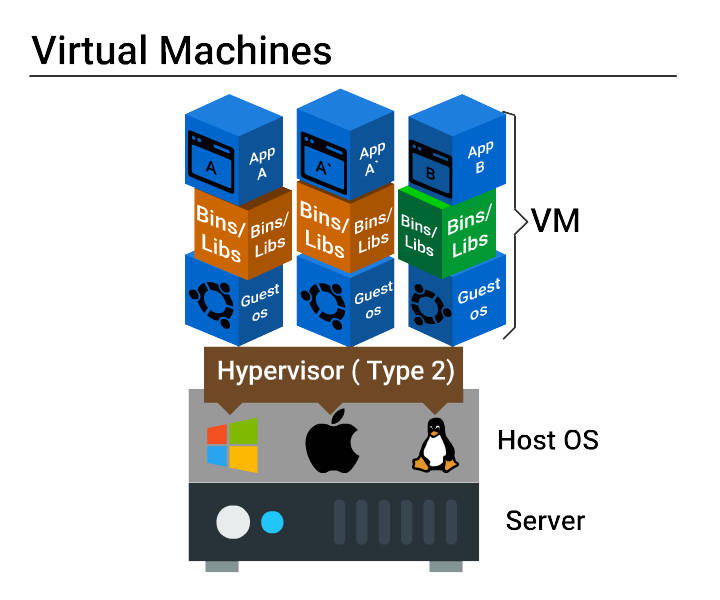
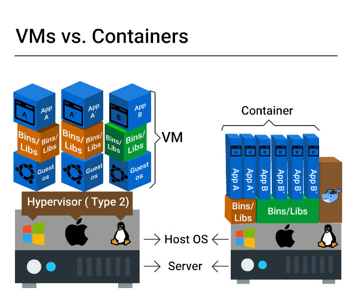
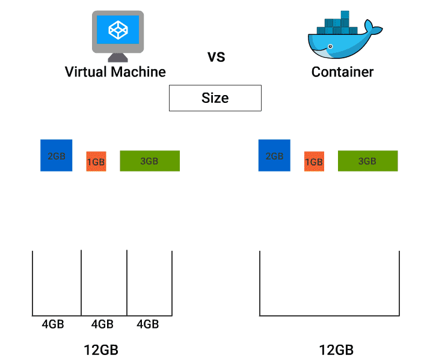
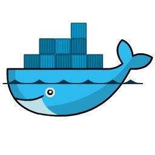
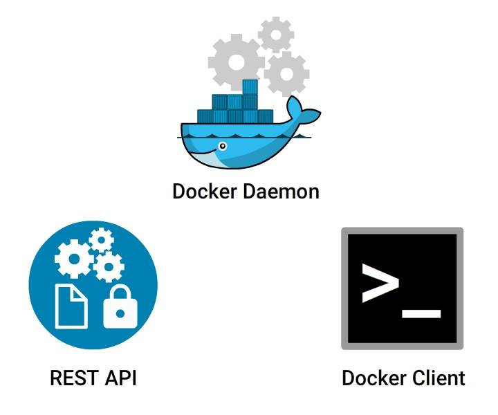
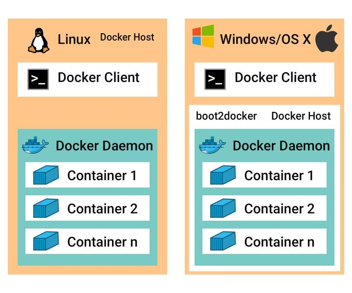
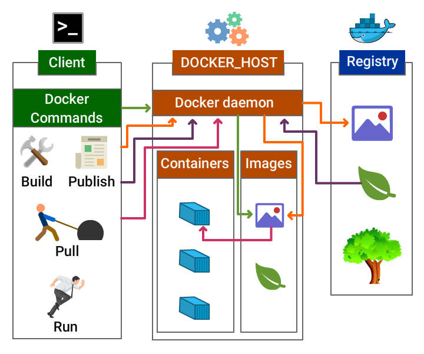
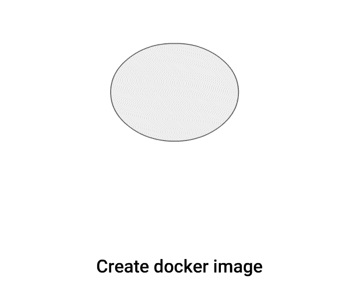
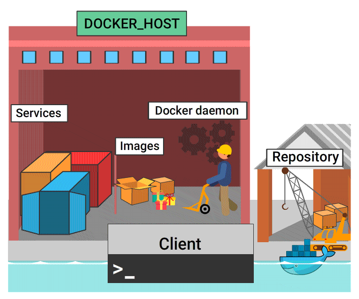

# VMs and Containers

## What is Virtualization?

**Virtualization is a creation of logical object version in place of an actual version.**

Few examples are virtual computer hardware platform, virtual storage, and virtual LANs.

**Hardware virtualization** means creating virtual machine that acts like a real physical computer with an OS.

For example, a virtual machine (VM) hosted on a computer with Microsoft Windows may behave like Ubuntu and Ubuntu supported software may run on the VM.



## Need for a Virtual Machine

Virtual machine setup has the following benefits.

* Multiple operating systems can be hosted on the same machine simultaneously with complete isolation.

* Multiple VMs can be deployed on the same physical box. This reduces the total number of physical machines.

* Easy maintenance, app provisioning, and quick recovery.

## Problems with Virtual Machine
* A lot of wastage of resources like ram, processor, disk space due to fixed space slicing for every application deployed. Hence this is not ideal for a large scale application developed using micro services.

* Inconsistent computing environment across the software delivery life cycle (Prod/Dev/QA).

* Hardware failures like malfunctioning and power supply loss will stop all working servers since many servers run on a single physical server.

## What are Containers?
Containers are multiple isolated services that are run on a single control host (underlying infrastructure) and they access a single kernel.

Container based virtualization is an OS-level virtualization method for deploying and running distributed applications without launching an entire VM for each application.

They isolate applications from one another.





- Size:

    VMs - Resource wastage is high

    Containers - No wastage
- Start up:

    VMs - Starts slow

    Containers - Starts really quick
- Integration with DevOps tools:

    VMs - Complex (infrastructure wastage, repetitive configuration and minimal scalability)

    Containers - Very simple

## Container - Benefits
* Improved portability

* Better performance

* Optimum RAM/disk space/cloud utilization

* Suited for agile environment

* Facilitates approaches such as micro services, continuous integration, and delivery.

* Eliminates environment inconsistencies

## Benefits from Container Orchestration Tools
Container Orchestration tools like Docker Swarm, Amazon ECS, and Azure Container Service:

* Facilitate auto deployment

* Scale application easily

* Quickly push application from one environment to another

* Enable automated rollbacks and backups

* Support load balancing and service healing

# Docker - Introduction


Docker is a tool intended to make the process of creating, deploying and running applications easier by using container based virtualization technology.

Docker is an open source container technology that provisions far more apps running on the same old servers compared to traditional VMs.

## Docker Engine
Docker engine is the Docker core component that is responsible for creating Docker Images and running them as services.

## Docker Core Components


Docker Engine Core Components:

* Docker Daemon

    Continuous running program (daemon process) that manages the service and other docker objects tied to it.

* REST API

    Specifies interfaces, that programs can utilize to speak to the daemon and direct it what to do.

* Docker Client

    CLI is utilized to interact with the daemon (docker command).

## Docker on Linux and non-Linux Kernel



* Docker hosted on Linux:

    This requires just a Docker client and Docker daemon.

* Docker hosted on non-Linux:

    * Docker desktop for mac uses HyperKit VM, which handles virtualization.
    * Docker desktop for windows uses Microsoft Hyper-V to manage virtualization.

# Docker Architecture



## Docker Components
Docker components include

* Docker daemon

* Docker client

* Docker Objects

    * Images

    * Containers / Services

    * Network

    * Volumes

* Docker Registry

## Docker Daemon and Docker Client

### Docker Daemon

Docker daemon is the docker process that receives requests from docker client and is responsible for managing docker objects such as containers, images, networks, and volumes.

### Docker Client

Docker client communicates with the docker daemon through Rest API calls. A docker client can send a request to many docker daemons.

### Docker Image
Docker image is the collection of all files, libraries, binaries and other dependencies forming an executable software application, which can run everywhere without glitches.

An image is an inert, immutable file

* Docker image is read-only, i.e., the image and its content cannot be altered.

* Although the alteration is not allowed in Docker, we are allowed to add the new layer with the changes.

* After having many alterations, a docker image may be visualized as several layers one above another.

## Parent and Child Images
The layering concept in docker images leads to the addition of required capabilities efficiently by adding a new layer to the existing one resulting in a new image.

Hence, the image has the parent-child relationship where the original image is termed as the base image upon which several child images are added.

## Docker Service / Container
Containers are run-time instances of Docker images that can be run using the Docker run command.

The fundamental purpose of Docker is to run containers.

You can run a docker image to create as many docker containers as you want.

## Docker Lifecycle


## Docker Network
The concept of networking in Docker comes into account when working with Docker in a real time scenario at a large scale.

Docker Networking helps us to share data across various containers.

Host and containers in Docker are tied with 1:N relationship, which means one host can command multiple containers.

Modes of Networking

Various modes for networking is all about how we manage connections between containers.

* Bridge mode Networking

* Host Mode Networking

* Container Mode Networking

* No Networking

## Docker File
Dockerfile is a script, formed of different arguments and commands (instructions) listed successively to automatically execute actions on a base image to form or create a new one.

A Docker File is a simple text file with instructions on how to build your images.

## Docker Registry
Docker Registry (Docker Repository) is a storage house for the Docker Images. It can be accessed publicly or privately by developers across the world.

* Docker images can be sent to registry by using docker push subcommand.

* Docker images can be downloaded from the registry using docker pull subcommand.

Following are the places where Docker registry can be hosted:

* Docker Hub

* AWS Container Registry

* Google Container Registry and lot more

## Docker Hub
Docker hub is one of the repositories of images which can be accessed at index.docker.io.

Docker Hub is the official repository by Docker development community. Any third party images can be pulled from the repository.

e.g.: 
<code>docker pull thedockerbook/helloworld </code>

## Docker Storage

### Storage drivers
Container layer contains a very thin writable layer, unlike images that have read only layers.

Each container has its storage layer whereas they share the read only image layer across containers in the same host.

Docker uses storage drivers that will manage the data using copy-on-write mechanism.

### Copy-on-write mechanism

Docker engine does not copy the whole image when we try to launch it. Instead, it uses Copy-on-write mechanism by which it uses a single copy of shared data until the data within the image is modified.

This saves a lot of disk volume, and the startup process is quick.

### Volumes

Volume is a directory mounted in the container that is created using docker command.

They are used to share data between containers by using the same volume across various containers.

## Docker in 12 Minutes
[](https://www.youtube.com/watch?v=YFl2mCHdv24)

# Docker Workflow


Docker workflow includes the following components:

* Docker Image - Read only template that stores the application and environment.

* Docker Container - Runtime instance of a docker image

* Docker registry - Public and private repositories to store images

* Docker File - Automates Image construction

* Docker file Compose - Compose is a tool that can be used to manage multiple containers containing different applications.

Part 1

* Create a <code>docker file</code> that includes details on the base and child images to be built.

* Build the docker file using <code>docker build</code> command and <code>tag</code> a name to the image.

* Verify if the image is built successfully using <code>docker images</code> command and Run <code>docker inspect</code> command to view the complete details of the image.

* Now the image is ready, push the same to the image repository using <code>docker push</code> command.

Part 2

* Pull the newly created image from the repository using <code>docker pull</code> command.

* Run the image using <code>docker run</code> command or using Dockerfile <code>compose</code>.

* Now you can verify the running container using <code>docker ps</code> command.


# Docker Commands

## Docker Basic Commands
Here are few basic docker commands.

Check the version of Docker:
```console
docker version 
```

Check the detailed information on the running/stopped containers:
```console
docker info 
```

Docker images can be downloaded from Docker hub using docker commands.

Lets pull an image from docker hub using pull command.

Download a image from docker hub
```console
docker pull <<image name>> 
e.g. docker pull nginx
```

## Docker Commands - Images
Verify the downloaded docker images:
```console
docker images ↵
```

View all the commands that were run with an image via a container.
```console
docker history <<Image Name>>  ↵
e.g. docker history nginx
```

Remove Docker Images
```console
docker rmi <<Image Name>>  ↵
e.g. docker rmi nginx
```
Download and run an image in docker container using run command
```console
docker run <<Image Name>>  ↵
e.g. docker run --name nginxservice -d nginx
```
<code>
--name --> to specify a name for the running service. In this example, it is nginxservice

-d --> to run the service in the background
</code>

## Docker Version Tag
You must have noticed that on pulling the image from the Registry, the tagged version of the image is displayed:

For example, <code>docker pull busybox:1.24</code> will download the corresponding version

## Docker Search
We can also search for the images in the Docker Hub registry by using <code>docker search</code> subcommand. Let us search for <code>ubuntu</code> images in the Docker Hub, and limit the search result only to 20 because we have more than 2000 images on Ubuntu:

<code>docker search ubuntu | head -20</code>

## Docker Commands - Container
Now lets run list of commands on the service/ container

List running containers
```console
docker ps
```
Know the IP address of the running container:
```console
docker inspect <Container Name> 
e.g. docker inspect nginxservice
```
Print the stats for a running Container
```console
docker stats <<Container Name>> ↵
e.g. docker stats nginxservice
```
Pause the processes in a running container
```console
docker pause <<Container Name >> ↵
e.g. docker pause nginxservice
```
Unpause the processes in a running container
```console
docker unpause <<Container Name >> ↵
e.g. docker unpause nginxservice
```

Kill the processes in a running container
```console
docker kill <<Container Name >> ↵
e.g. docker kill nginxservice
```
Start the same container:
```console
docker start <<Container Name>> ↵
e.g. docker start nginxservice
```
Stop the running container
```console
docker stop <<Container Name >> ↵
e.g. docker stop nginxservice
```
List all containers (This includes containers in a all states):

We will be able to see the container we just stopped listed here.
```console
docker ps -a 
```
Delete a container:
```console
docker rm <<Container Name >> ↵
e.g. docker rm nginxservice
```
To remove all stopped containers:
```console
docker container prune 
```
**Note: Instead of using the Container Name, all the above commands can be executed with the container id as well.**

Export a container
```console
docker export <<Container Name>> <<file_Name>>.tar ↵
e.g. 
Lets run a service using docker run command.
docker run --name newnginxservice -d nginx
docker export newnginxservice > test.tar
```
Import a container
```console
docker import <<Remote URL/Image Name.tar>>  ↵
e.g. docker import test.tar
```

## Docker daemon Commands
Stop Docker daemon process
```console
service docker stop  
```
Start Docker daemon process
```console
service docker start
```

## Diagnose Run Issues
In case you are having a problem with downloading the images and running them, please follow these steps to check whether the docker service is running on your system or not:

Check the running status of docker:
```console
service docker status
```
Restart Docker service in your system:
```console
service docker restart
```


# Docker - Installation

## Prerequisite for installation of Docker on Linux are:

* 64-bit architecture Linux
* Linux kernel must be 3.10 or later

Here are the steps for installing the community edition in Ubuntu 16.04:

* Add the GPG key for the official Docker repository to the system:
```console
$ curl -fsSL https://download.docker.com/linux/ubuntu/gpg | sudo apt-key add -
```
* Now add the Docker repository to APT sources:
```console
$ sudo add-apt-repository "deb [arch=amd64] https://download.docker.com/linux/ubuntu $(lsb_release -cs) stable"
```

1. Now update the package database with the Docker packages:
```console
$ sudo apt-get update
```
2. Check for the policy:
```console
$ apt-cache policy docker-ce
```
3. Install Docker:
```console
$ sudo apt-get install -y docker-ce
```
4. Check the installed version of Docker:
```console
$ sudo docker --version
```

## Installation Using Automated Script
Are you feeling this procedure lengthy? There is a shortcut to this process.

Just run the below command to install Docker

curl command
```console
$ sudo curl -sSL https://get.docker.io/ | sh
```

## Uninstall Docker CE
This command is used to uninstall Docker CE package in Ubuntu machine.
```console
$ sudo apt-get purge docker-ce
```

# Hands-on scenario
Welcome to the Docker challenge, your task is to follow the below steps and complete them successfully.

*Perform the following actions described below by executing the respective commands. Open terminal and execute the commands. *

1. Check the version of Docker.
2. Check the detailed information on the running/stopped containers.
3. Download <code>tomcat:latest</code> image from docker hub.
4. Verify the downloaded docker images.
5. View all the commands that were run on the <code>tomcat:latest</code> image (check docker image history).
6. Remove tomcat:latest docker image.
7. Download and run an <code>nginx:latest</code> image in the docker container using the run command, name the container nginxservice.
8. Pull <code>busybox:1.24</code> docker image.
9. Search for ubuntu images in the Docker hub, and limit the search result to 20.
10. List all containers.
11. Identify the IP address of the running container <code>'nginxservice'</code>.
12. Print the stats for a running container <code>'nginxservice'</code>.
13. Pause the processes in a running container <code>'nginxservice'</code>.
14. Start the processes in a running container <code>'nginxservice'</code>.
15. Kill the processes in a running container <code>'nginxservice'</code>.
16. Start the same container <code>'nginxservice'</code>.
17. Stop the running container <code>'nginxservice'</code>.
18. List all containers (including the containers in all states).
19. Export the container <code>'nginxservice'</code> and name the tar as 'test.tar'.
20. Delete the container <code>'nginxservice'</code>.
21. Remove all stopped containers by pruning them.
22. Import the container 'test.tar'

* Create an <code>nginx</code> Dockerfile with index page that returns the string <code>'Welcome to fresco'</code>

* Build the image and name it <code>'nginximage'</code>, run the image and expose it on <code>port 80</code> and name it <code>'nginxcontainer'</code>

* Start a container registry image using following command <code>docker run -d -p 5000:5000 --restart=always --name registry registry:2</code>

* Write the following content to <code>/etc/docker/daemon.json</code> file to avoid http security error. Replace the string with registry container ip.
```json
{
  "insecure-registries" : ["replace-with-registry-ip:5000"]
}
```
* Restart docker service using the command <code>'sudo service docker restart'</code>

* Push the <code>nginximage</code> image to registry. (Hint: need to tag the docker image with the registry ip and port)