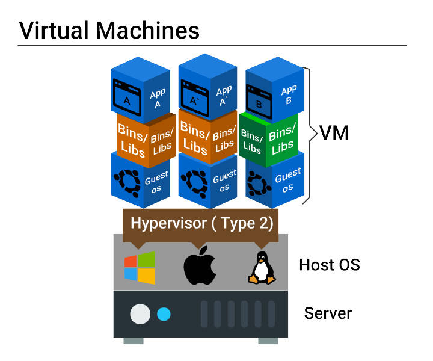
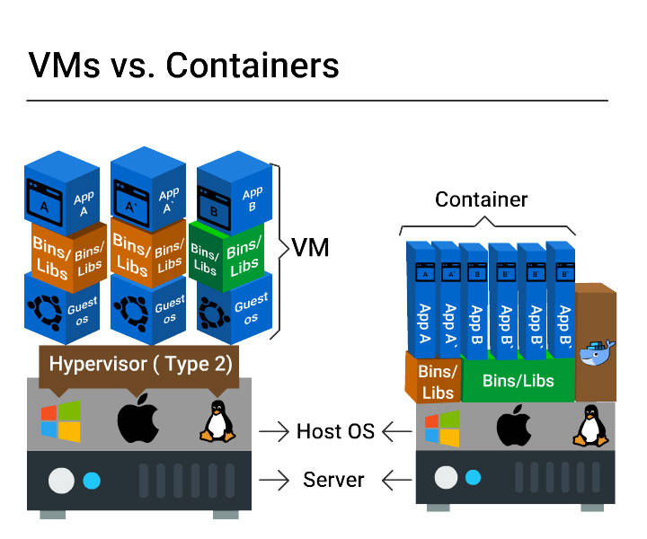
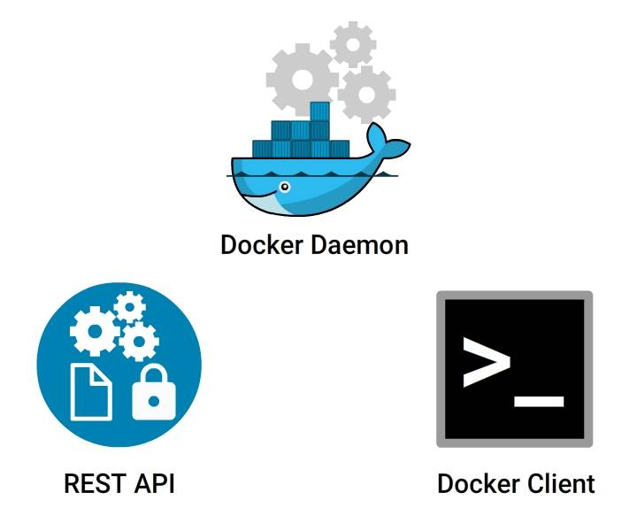
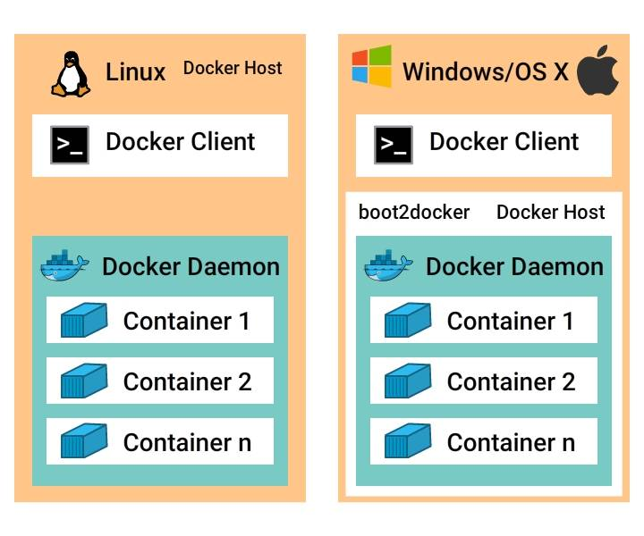

# Docker Learning Guide

A practical introduction to containers, Docker images, networking, storage, and
Docker Compose. The repository includes a runnable Nginx example so that the
concepts can be tested instead of only read.

> The commands in this guide use Docker Engine with the Compose plugin
> (`docker compose`). Docker Desktop already includes both.

## Contents

- [Containers and virtual machines](#containers-and-virtual-machines)
- [Docker architecture](#docker-architecture)
- [Core concepts](#core-concepts)
- [Install Docker](#install-docker)
- [Quick start](#quick-start)
- [Command reference](#command-reference)
- [Build an image](#build-an-image)
- [Use Docker Compose](#use-docker-compose)
- [Networking](#networking)
- [Storage](#storage)
- [Local registry](#local-registry)
- [Hands-on exercises](#hands-on-exercises)
- [Troubleshooting and cleanup](#troubleshooting-and-cleanup)

## Containers and virtual machines

Virtualization allows multiple isolated computing environments to share one
physical host. A virtual machine emulates a complete computer and runs its own
kernel. A container is an isolated process that shares the host kernel while
bringing the files and configuration its application needs.



| | Virtual machine | Container |
|---|---|---|
| Isolation boundary | Complete guest operating system | Process and kernel namespaces |
| Kernel | One per VM | Shared with the host |
| Typical size | Gigabytes | Megabytes to gigabytes |
| Startup | Usually seconds to minutes | Usually milliseconds to seconds |
| Best fit | Different kernels, strong OS boundary | Portable application packaging and scaling |

Containers and VMs are complementary. Cloud workloads commonly run containers
inside VMs. Containers are efficient, but they do not mean "no overhead" and
they are not automatically secure; image provenance, least privilege, resource
limits, patching, and runtime configuration still matter.



## Docker architecture

Docker uses a client-server design:

- The **Docker client** sends commands such as `docker build` and `docker run`.
- The **Docker daemon** manages images, containers, networks, and volumes.
- A **registry** stores and distributes images. Docker Hub is the default public
  registry, but private registries are also supported.
- The client communicates with the daemon through the Docker Engine API.



On Linux, containers use Linux kernel features directly. Docker Desktop runs a
small Linux virtual machine when Linux containers are used on macOS or Windows.



## Core concepts

### Image

An image is an immutable, layered package containing the files, binaries,
libraries, configuration, and metadata needed to create a container. Rebuilding
after a change creates new layers and a new image; it does not modify an
existing image in place.

### Container

A container is a runnable instance of an image. Each container gets a writable
layer, configuration, networking, and an isolated process tree. Deleting a
container deletes its writable layer, so important data belongs in a volume or
bind mount.

### Dockerfile

A `Dockerfile` is the recipe used to build an image. Keep the build context
small with `.dockerignore`, use trusted base images, and avoid placing secrets
in the file or build context.

### Registry and repository

A registry hosts image repositories. An image reference has this general form:

```text
[registry-host[:port]/]namespace/repository[:tag][@digest]
```

For example, `docker.io/library/nginx:alpine` identifies the `alpine` tag of the
Docker Official Image for Nginx. Tags can move; use a digest when exact
reproducibility is required.

### Docker Compose

Compose defines one or more related services in a YAML file. The current CLI is
`docker compose`; the older standalone `docker-compose` command is legacy.

## Install Docker

Installation changes over time, so use the maintained instructions:

- [Docker Desktop](https://docs.docker.com/desktop/) for Windows, macOS, or Linux
- [Docker Engine](https://docs.docker.com/engine/install/) for a Linux server
- [Ubuntu installation](https://docs.docker.com/engine/install/ubuntu/) for the
  official APT repository steps

Avoid old instructions based on `apt-key` or Ubuntu 16.04. Docker's convenience
script is intended for development and testing, not unattended production
provisioning.

Verify the installation:

```console
docker version
docker info
docker compose version
docker run --rm hello-world
```

On Linux, the daemon is normally managed with systemd:

```console
sudo systemctl status docker
sudo systemctl start docker
sudo systemctl restart docker
```

## Quick start

Run an Nginx container and publish host port `8080` to container port `80`:

```console
docker run --name web -d -p 8080:80 nginx:alpine
docker ps
curl http://localhost:8080
docker logs web
docker stop web
docker rm web
```

`--name web` gives the container a stable name, `-d` runs it in the background,
and `-p 8080:80` publishes the port. Image names without an explicit registry
resolve to Docker Hub by default.

## Command reference

### Images

```console
# Download and list images
docker pull nginx:alpine
docker image ls

# Inspect metadata and build history
docker image inspect nginx:alpine
docker image history nginx:alpine

# Tag and remove an image
docker image tag nginx:alpine example/nginx:demo
docker image rm example/nginx:demo
```

### Containers

```console
# Create and start a named background container
docker run --name web -d -p 8080:80 nginx:alpine

# List running containers, then all containers
docker container ls
docker container ls --all

# Inspect, follow logs, and show live resource usage
docker container inspect web
docker container logs --follow web
docker container stats web

# Run a command in a running container
docker container exec -it web sh

# Pause, unpause, stop, start, and remove
docker container pause web
docker container unpause web
docker container stop web
docker container start web
docker container rm --force web
```

Prefer `docker stop` for a graceful shutdown. `docker kill` sends a signal
immediately and is mainly useful when a process does not stop normally.

### Copy and export

Copy files between a container and the host:

```console
docker cp web:/etc/nginx/nginx.conf ./nginx.conf
docker cp ./index.html web:/usr/share/nginx/html/index.html
```

`docker export` creates a tar archive of a container filesystem and `docker
import` creates a filesystem image from such an archive. They do not preserve
image history or volume contents. Use `docker image save` and `docker image
load` when transferring images with their tags and layers.

```console
docker image save nginx:alpine -o nginx-image.tar
docker image load -i nginx-image.tar
```

## Build an image

The [`examples/nginx`](examples/nginx) directory contains a small static site:

```dockerfile
FROM nginx:alpine
COPY index.html /usr/share/nginx/html/index.html
HEALTHCHECK --interval=30s --timeout=3s --start-period=5s --retries=3 \
  CMD wget --quiet --tries=1 --spider http://127.0.0.1/ || exit 1
```

Build and run it from the repository root:

```console
docker build --tag docker-learning-nginx:local examples/nginx
docker run --name docker-learning-nginx --rm -d -p 8080:80 \
  docker-learning-nginx:local
curl --fail http://localhost:8080
docker stop docker-learning-nginx
```

The final argument to `docker build` is the build context. Docker can only
`COPY` files from that context, subject to `.dockerignore` rules.

## Use Docker Compose

The included [`compose.yaml`](compose.yaml) builds and runs the same example:

```console
docker compose config
docker compose up --build --detach
docker compose ps
curl --fail http://localhost:8080
docker compose logs --follow
docker compose down
```

Compose automatically creates a project network, provides service-name DNS,
and keeps the declared configuration in version control. `docker compose down`
removes the project's containers and network; add `--volumes` only when you
also intend to delete its named volumes.

## Networking

Docker Engine includes several network drivers:

- **bridge**: the normal choice for containers on one host. User-defined bridge
  networks provide automatic DNS between containers.
- **host**: removes network isolation and uses the host network directly. It is
  supported differently across platforms.
- **none**: disables external networking for the container.
- **overlay**: connects services across Docker Swarm nodes.

```console
docker network ls
docker network create app-network
docker run --name web --network app-network -d nginx:alpine
docker network inspect app-network
docker network rm app-network
```

Publishing a port with `-p` can make it reachable beyond localhost. Bind to the
loopback address when only local access is needed:

```console
docker run --rm -d -p 127.0.0.1:8080:80 nginx:alpine
```

## Storage

- A **volume** is persistent storage managed by Docker. It is usually the best
  option for application data.
- A **bind mount** maps a host path into a container. It is useful for source
  code and configuration during development.
- A **tmpfs mount** stores temporary data in memory on supported platforms.

```console
# Named volume
docker volume create app-data
docker run --rm --mount source=app-data,target=/data alpine \
  sh -c 'date > /data/created-at'
docker run --rm --mount source=app-data,target=/data alpine \
  cat /data/created-at

# Read-only bind mount
docker run --rm --mount type=bind,source="$PWD",target=/workspace,readonly \
  alpine ls /workspace
```

Removing a container does not remove a named volume. Review volume contents and
backups before pruning storage.

## Local registry

Run a local development registry on loopback:

```console
docker run --name registry --restart=always -d -p 127.0.0.1:5000:5000 \
  registry:2
docker image tag docker-learning-nginx:local \
  localhost:5000/docker-learning-nginx:local
docker image push localhost:5000/docker-learning-nginx:local
docker image pull localhost:5000/docker-learning-nginx:local
```

`localhost` registries are treated specially for local development. Do not add
an arbitrary remote registry to `insecure-registries`; configure TLS and
authentication for any registry shared over a network.

## Hands-on exercises

1. Verify Docker Engine and Compose, then run `hello-world`.
2. Pull `nginx:alpine`, inspect it, and review its layer history.
3. Run Nginx on `127.0.0.1:8080`, check its logs, and inspect its network.
4. Stop and restart the same container, then remove it.
5. Build the included Nginx example and confirm its health status.
6. Start the example with Compose, inspect the resolved configuration, and
   bring the project down.
7. Create a named volume, write a file from one container, and read it from a
   second container.
8. Save an image to a tar archive, remove the local image, and load it again.
9. Push the example image to the local loopback registry.
10. Run `./scripts/validate.sh` to check the repository and example build.

## Troubleshooting and cleanup

```console
# Daemon and client information
docker version
docker info

# Container diagnostics
docker container ls --all
docker container logs CONTAINER
docker container inspect CONTAINER

# Disk usage
docker system df
```

Cleanup commands remove data. Inspect their targets first:

```console
docker container prune
docker image prune
docker volume prune
docker network prune
```

Avoid `docker system prune --all --volumes` unless deleting every unused image,
container, network, build cache entry, and volume is truly intended.

## Further reading

- [Docker overview](https://docs.docker.com/get-started/docker-overview/)
- [Docker workshop](https://docs.docker.com/get-started/workshop/)
- [Dockerfile best practices](https://docs.docker.com/build/building/best-practices/)
- [Docker CLI reference](https://docs.docker.com/reference/cli/docker/)
- [Compose documentation](https://docs.docker.com/compose/)
- [Docker storage](https://docs.docker.com/engine/storage/)
- [Docker networking](https://docs.docker.com/engine/network/)
